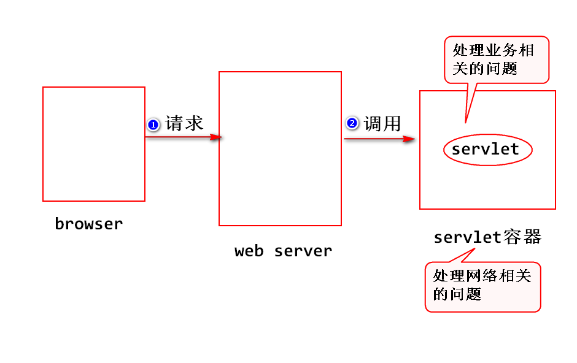

2018-5-28  Day01
## 什么是Servlet?
   sun公司制定的一种用来**扩展web服务器功能**的**主键规范**.
1. 用来扩展web服务器功能 :
	- web服务器只能处理静态资源的请求(即需要事先将html文件准备好,并存放到制定的文件夹下面),不能够处理动态资源的请求(即需要计算,生成动态页面),所以需要扩展其功能.
	- Servlet可以扩展web服务器功能,当web服务器收到请求之后,如果需要计算,可以调用Servlet来处理.

2. 组件规范 :
	- 什么是组件?
	  -> 符合规范,实现部分功能,并且需要部署到相应的容器里面才能运行的软件模块.
	  -> Servlet就是一个组件,需要部署到Servlet容器里面才能运行.

	- 什么是容器?
	  -> 符合规范,提供组件运行环境的程序.
	  -> Servlet容器需要符合Servlet规范,为Servlet提供网络相关的服务.

## Tomcat 开源的: www.apache.org可以Download
- 安装Tomcat :
		1.先下载Tomcat安装文件.并将安装文件放在XX盘.
		2.打开Ecplise -> Window -> Preferences -> Server -> Server Runtime Environments -> Add -> Apache 选择Tomcat版本,并且勾选 Create a new local server-> next 找到安装目录 -> finish
		3.Window -> show view -> Servers -> 双击配置好的 Tomcat -> Server Locations 选择 Use Tomcat installation (takes control of Tomcat installation)

- 如何写一个Servlet?
	step1 : 写一个JAVA类,实现Servlet接口或者继承HttpServlet抽象类
	> 注 : 一般选择继承.

	step2 : 编译.(javaC)
	step3 : 打包.(将它变成一个组件)
		结构:
		[-appname(应用名)
		  |-WEB-INF
		    |-classes(放.class文件)
		    |-lib (可选,放.jar文件)
			|-web.xml(部署描述文件)

	step4 : 部署.(即:将第三步创建的整个文件夹copy到容器里面)
	> 注 : 可以使用jar命令将step3创建的整个文件夹压缩成".war"结尾的文件,然后拷贝这个文件就可以了.

	step5 : 先启动servlet容器,再访问servlet.
	> http://ip:port/appname/url-pattern
	> url-pattern在web.xml文件当中设置.
	> 示例 : http://localhost:8080/ServletDay01/hello
	> 内容 : Hello World , Hello Servlet

- 当访问量大,高并发时,使用专业的web server服务器,如果日常使用,访问量不大,Tomcat可以满足需求.

# 使用eclipse开发需要注意的事项

# 参考代码
	public class HelloServlet extends HttpServlet{
	@Override
	/**
	 * Servlet容器收到请求之后,会调用Servlet的service方法来处理请求. 
	 * 注:
	 *   容器会实现创建好request(请求)和response(响应),其中request
	 * 对象封装了请求数据包里面的所有数据,我们可以将处理结果写到response  
	 * 对象里面,然后容器负责从response对象中获取处理结果,然后打包发送给
	 * 服务器.
	 */
	protected void service(HttpServletRequest request,HttpServletResponse response)throws ServletException, IOException {

		response.setContentType("text/html");   //设置 content-type消息头,告诉浏览器,服务器返回的数据类型
		PrintWriter out = response.getWriter(); //通过response对象获得输出流.
		/**
		 * 实际上是把数据写到了响应对象里面,还没有发出去;
		 * 注:
		 *   Servlet容器会将response对象上存放的数据取出来,打一个包(数据响应包),然后发送给浏览器.
		 */
		out.println("<h1>Hello World,Hello Servlet</h1>");
		out.close();   //此行不写也可以,它通过响应对象获得,如果没有调用out.close,则容器会自动关闭out.
	}
}

## Servlet是如何运行的?
- 比如在浏览器地址栏输入:  http://ip:port/ServletDay01/hello
	step1 : 浏览器依据ip,port与Tomcat建立连接.
	step2 : 浏览器将请求数据打包,并发送请求.
	> 注 : 即按照http协议要求,创建请求数据包,并把该请求数据包发送给Tomcat.

	step3 : Tomcat收到请求数据包之后,然后拆包,并且将解析到的数据存放到request对象里面,同时创建一个response对象.
	> 注 : 拆包,即按照http协议要求,解析请求数据包的内容.

	step4 : Tomcat将servlet实例化,然后调用该实例的service方法.
	> 注 : Tomcat会将request对象和response对象作为参数传递给service方法.开发人员可以通过调用request对象提供的方法来获取请求数据包里面的数据,也可以将处理结果写入response对象.

	step5 : Tomcat会从response对象中获取处理结果,然后打包发送给浏览器.

	step6 :浏览器解析响应数据包，生成页面．

## 常见问题:
- 404问题
	    含义 : 404是一个状态码,服务器依据请求路径找不到对应的资源.
		原因 :
		       a.请求路径写错.    http://ip:port/appname/url-pattern
			   b.忘记部署或者部署失败.
- 405问题
		含义 : 服务器找不到处理方法.
		原因 :
			   a.没有正确override HttpServlet的service方法.
			   b.用来访问本页面的 HTTP 谓词不被允许（方法不被允许）

- 500问题
		含义 : 服务器运行时发生异常
		原因 :
		      a.代码不规范.没有严格按照servlet规范来写.
			  (例如没有继承HttpServlet.)(配置文件中,servlet-class写错)
			  b.代码不严谨.
			  (例如对请求参数值没有做检查就进行类型转换.)
			  (配置文件内的两个类名不一致会导致错误)

> 任何一个网络服务端都需要一个端口用来监听

# tcp/ip抓包工具(了解即可，不用掌握)

