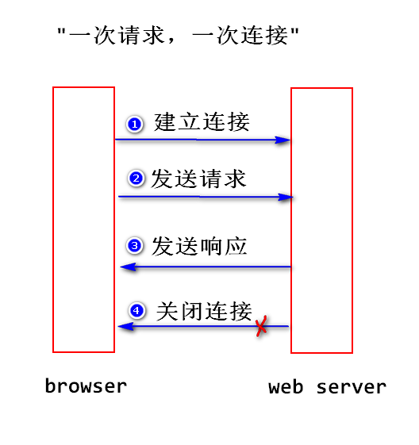
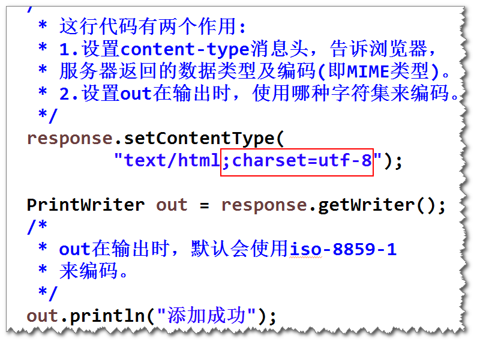
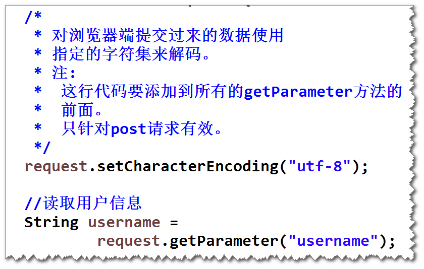
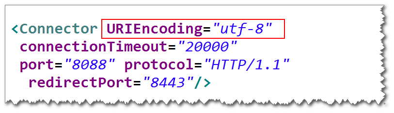

2018-5-29  Day02
# Http协议(了解)
## http协议是什么(高层协议)?
- 是一种网络应用层协议,规定了浏览器与web服务器之间的通信以及相应的数据包的格式.
- HTML : 超文本标记语言
- TCP/IP : 传输层和网络层协议**(低层协议)**,它可以确保数据可靠的传递.
- Http协议将数据打包之后,需要依赖TCP/IP协议来传递数据包.
		-> 通信过程:(4个步骤)
		   ①建立连接
		   ②发送请求
		   ③发送响应
		   ④关闭连接
		-> 优点 : web服务器可以利用有限的连接数为尽可能多的请求服务.

## 数据包的结构
- 请求数据包:
	a.请求行(请求方式 请求资源路径 协议和版本):
		GET /BimTest/bmi?height=1.9&weight=90 HTTP/1.1
		<--请求资源路径-->

	b.若干消息头:
		注:
			消息头是一个键值对,(以" : " 隔开),浏览器与web服务器之间可以通过发送消息头来传递一些特定的信息,比如浏览器可以发送"user-agent"消息头告诉服务器,浏览器的类型和版本.
	c.实体类容
		注:
			get请求没有数据,只有发送post请求时,才会有数据(请求参数)

- 响应数据包
	a.状态行 (协议和版本 状态码 状态描述)
	    注:
			200 : 正确
			404 : 依据请求路径找不到对应的资源
			500 : 系统出错

	b.若干消息头:
	    注:
			服务器也可以将一些消息头发送给浏览器.
			比如: 通过发送"content-type"消息头,告诉浏览器,服务器发送过来的数据类型以及编码.
	c.实体内容
		注:
			程序处理的结果,浏览器需要解析出来,生成相应的页面展示内容.

## 两种请求方式
- GET请求:
	a.哪一些情况下,浏览器会发送GET请求?
	  ①在地址栏输入某个地址.
	  ②点击链接
	  ③表单默认的提交方式
	 > 特点:
	 > -> 会将请求参数显示在浏览器地址栏,不安全.

	 >    注 : 有一些网络设备(比如路由器),会记录所有的请求地址,如果包含了敏感的请求参数,则不安全.会将请求参数添加到请求行(也就是请求资源路径的后面),只能提交少量的数据.[整个请求行大约只能存放约2K左右]

- POST请求:
	a.哪一些情况下,浏览器会发送post请求?
	使用 : 设置表单的method属性为"post";
	>特点:
	>1. 浏览器地址栏不会显示请求参数,相对安全.
	>注: 不管是哪种请求类型,都不会对数据加密.对于敏感数据,一定要加密处理.
	>
	>2. 请求参数会添加到实体内容里面,可以提交大量的数据.
	>注 : 实体内容里面添加的数据量理论上是没有限制的.

## 如何去获取请求参数值
- 方式一:
		String request.getParameter(String paramName);
		注:
			paramName : 请求参数名
			如果请求参数名写错,则返回Null.(什么都不输会返回空字符串)

- 方式二:
		String [] request.getParameterValues(String paramName);
		注:
			有多个请求参数名相同时,用该方法.(因为该方法返回值一个数组,如果用方式一去接收会导致一些数据的丢失)

## Servlet输出中文时产生的乱码问题:
- 为什么会出现乱码?
  -> 因为out输出时,默认会使用ISO-8859-1来编码,此编码不支持中文.

- 解决
  -> 在设置消息头时,告诉浏览器服务器返回的数据类型,添加指定编码.
  	res.setContentType("text/html;charset=utf-8");

- 解决控制台输出乱码:

  -> 情形一 : POST请求
        在所有的getParmeter方法的前面添加这行代码:
		req.setCharacterEncoding("utf-8");

  -> 情形二 : GET请求
		修改server.xml,添加在<Connector>端口8080标签内添加:
		URIEncoding="utf-8"
		例如:<Connector URIEncoding="utf-8" connectionTimeout="20000" port="8080" protocol="HTTP/1.1" redirectPort="8443"/>
