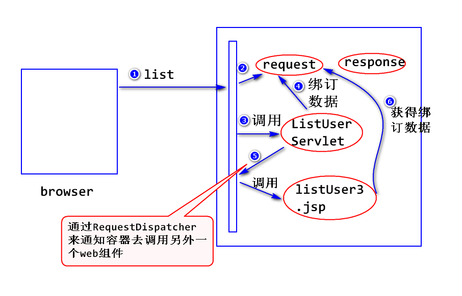

2018-6-1  Day05
# 转发

## 什么是转发？
- 一个web组件将未完成的处理交给另外一个web组件继续做.
	  注:
	  	a.web组件值得是Jsp或者servlet
		  b.常见的常见是一个servlet获取处理结果之后,转交给一个Jsp来展现.


## 如何转发.
- step1: 绑定数据到request对象上
	  request.setAttribute(String name,Object obj);
	  注:
	  	 name 一般称之为绑定名
		   obj  一般称之为绑定值.
		   Object request.getAttribute(String name);

- step2: 获得转发器.
	  RequestDispatcher rd = request.getRequestDispatcher(String url);
	  注:
	  	 a. RequestDispatcher是一个接口,该方法会返回一个符合改接口要求的对象,我们一般称之为转发器.
		   b. uri是转发的目的地,比如一个jsp. 
		   c. 转发的本质是一个web组件通过转发器通知容器去调用另外一个web组件.

- step3: 转发.
	  rd.forward(request,response);

- 特点:
	  a.转发之后,浏览器地址栏的地址不变.
	  b.转发的目的地地址是有限制的,要求是同一个应用中的的某个web组件的地址.

## 比较转发与重定向
- 能否共享request对象?
	  转发可以,而重定向不可以.
	  注:
	  	 a.当请求到达容器时,容器会立即创建request对象和response对象,当响应发送完毕,容器会立即销毁这两个对象.也就是说request和response的生存时间是一次请求与响应期间存在
		 b.转发是一次请求,重定向是两次请求(第一次是访问servelet,第二次通知服务器访问jsp)

- 浏览器地址栏的地址有无变化?
	  转发无变化,重定向有变化.

- 目的地有无限制?
	  转发有限制(同一个应用),而重定向没有任何限制.


## 登录业务
- 流程：
		首先由用户填写用户名和密码并提交,服务器端检查是否有匹配条件的记录,如果有则登陆成功,并跳转到用户列表页面;否则登录失败,跳转到登录页面并提示用户.

- 步骤:
	  step1 : UserDAO类
	  	方法一: public boolean find(String username,String possword);
		方法二: public User find(String username);
		注:
		  如果用户名存在,返回一个完整的User对象(该对象包含了用户的所有信息),如果用户名不存在则返回Null.

	  step2 : 测试UserDAO类.
	  step3 : 编写Login.jsp登录页面.
	  step4 : LonginServlet
	  注:
	      a.读取用户名和密码
		  b.调用UserDAO的find方法
		  c.登录成功 : 重定向到Select;
		    登录失败 : 转发到Login.jsp

## 路径问题
- 什么是路径问题?
	  链接地址,表单提交,重定向,转发都需要填写一个路径(或者也可以称之为地址).
	  链接地址: <a href="">
	  表单提交: <form action="">
	  重定向: response.sendRedirect("");
	  转发: request.getRequestDispatcher("");

- 相对路径 : 不以"/"开头的路径;

- 绝对路径 : 以"/"开头的路径;

- 如何写绝对路径?
	  链接,表单提交,重定向从应用名开始写,转发从应用名之后开始写.


- 万能路径写法:
	  不要将应用名直接写在路径里面,而应该使用一下方法获得实际部署时的应用名:
	  		String request.getContextPath();