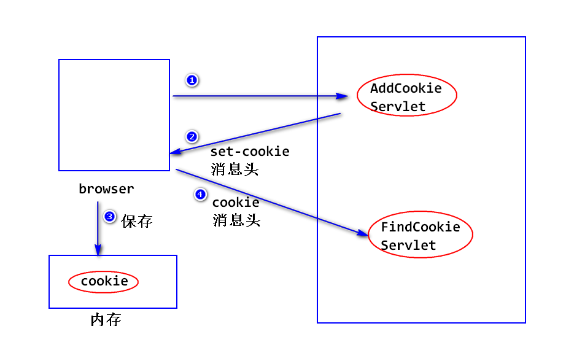
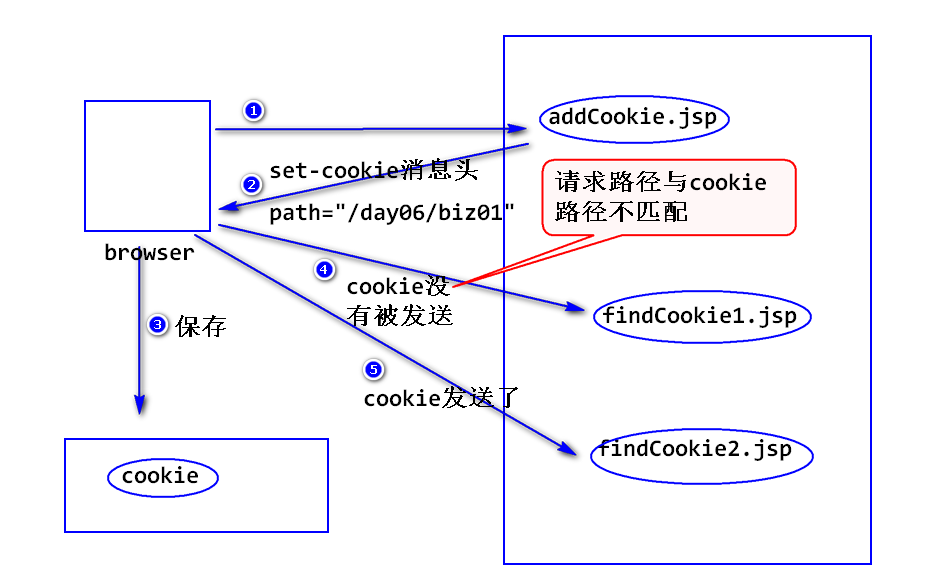

2018-6-4  Day06

# 状态管理
## 什么是状态管理?
- 将浏览器和web服务器之间多次交互当做一个整体来处理,并且将多次交互所涉及的数据(即状态)保存下来.

- 如何进行状态管理?
		a.将状态保存在浏览器端. Cookie技术

		b.将状态保存在服务器端. Session技术

## Cookie 技术
- 什么是Cookie?
	- 它是服务器临时存放在浏览器端的少量数据,这些数据用来跟踪用户的状态.

- 其工作原理?
	- 当浏览器访问服务器时,服务器会将少量数据以set-cookie消息头的形式发送给浏览器,浏览器会将这些数据保存下来;
	- 当浏览器再次访问服务器时,会将这些数据以cookie消息头的形式发送给服务器.



- 添加Cookie
		Cookie c = new Cookie(String name,String value);
		response.addCookie(c);
		注:
		   name 为 cookie名,value为cookie值,要求都是String.

- 读取Cookie
		Cookie[] request.getCookies();
		注:
		   a.一个Cookie对象封装了一个Cookie中的所有数据.
		   b.该方法有可能返回Null
		String cookie.getName();
		String cookie.gerValue();

- 编码问题
	- 什么是编码问题?
 ```
	  cookie只能保存合法的ascii字符,对于中文需要编码处理,即将中文转换成合法的ascii字符串的形式.
```
	- 如何处理?
```
	 String URLEncoder.encode(String str,String charset);
	 String URLDecoder.decode(String str,String charset);
```
	- 建议 :
	在添加cookie时,不管是不是中文,建议统一进行编码处理.

	- 生存时间问题
```
	a.默认情况下,浏览器会把cookie保存在内存里,浏览器只要不关闭,cookie就会一直存在,浏览器关闭,则cookie会被删除.

	b.可以调用setMaxAge方法来设置cookie的生存时间.
	  cookie.setMaxAge(int seconds);
	  注:
	     单位是秒,例如保存一年: setMaxAge(365*24*60*60);

		 值可以大于0 : 浏览器会将cookie保存在硬盘上(一般是以文件的形式来存放),如果超过指定的时间,cookie会被删除.

		 值可以小于0 : 缺省值(即将cookie保存在内存里面),浏览器一关就没了.

		 值可以等于0 : 删除cookie,比如要删除一个名称为city的cookie:
		 Cookie c = new Cookie("city","新城");
		 c.setMaxAge(0);
		 response.addCookie(c);
```

##　Cookie的路径问题
- 什么是cookie的路径问题?
		浏览器访问服务器上的某个地址时,会比较该地址是否与cookie的路径匹配,只有匹配的cookie才会被发送.

- cookie的默认路径
		等于添加该cookie的Web组件的路径.
		比如: /ServletDay06/biz01/addCookie.jsp添加了一个Cookie,则该Cookie默认的路径就是"/ServletDay06/biz01".

- 匹配规则
		如果请求路径是Cookie路径或者其子路径,则该Cookie会被发送.
		比如:cookie路径是 "/ServletDay06/biz01".
		如果请求路径是 /ServletDay06/findCookie1.jsp! 不会发送
		如果请求路径是 /ServletDay06/biz01/findCookie2.jsp!会发送
		如果请求路径是 /ServletDay06/biz01/abc/findCookie3.jsp!会发送


##实现一个简单的Cookie工具(CookieUtil)
```
package utile;

import java.io.UnsupportedEncodingException;
import java.net.URLDecoder;
import java.net.URLEncoder;

import javax.servlet.http.Cookie;
import javax.servlet.http.HttpServletRequest;
import javax.servlet.http.HttpServletResponse;

/**
 * 	Cookie工具类,提供了添加Cookie,读取Cookie,删除Cookie这三项基本功能. 
 */
public class CookieUtil {
	/** 
	 * 添加Cookie的方法 :
	 * name  : 值的名称
	 * value : 值的内容
	 * path  : Cookie的路径
	 * age   : Cookie的生存时间
	 */
	public static void addCookie(String name,String value,String path,int age,
			HttpServletResponse response) throws UnsupportedEncodingException {
	    value = URLEncoder.encode(value,"utf-8"); //此处会抛编码错误异常
		Cookie c = new Cookie(name,value); //设置传过来的参数值
		c.setMaxAge(age);  //设置生存时间
		c.setPath(path); //设置路径
		response.addCookie(c); //设置响应对象(它的作用是把值添加进响应对象里)
	}

	/**
	 * 依据Cookie的名称,读取对应的Cookie的值,如果找不到,则返回Null	
	 * 读取Cookie的方法: 
	 */
	public static String findCookie(String name,HttpServletRequest request) throws UnsupportedEncodingException {
		Cookie [] cookies = request.getCookies(); //创建Cookies对象数组
		if(cookies!=null){	//判断有无Cookie
			for (Cookie c : cookies) { //循环遍历Cookie内容
				if(name.equals(c.getName())) {  //判断name是否相等
					String value = URLDecoder.decode(c.getValue(),"utf-8"); //获取name对应的值并指定编码
					return value;  //返回值
				}
			}
		}
		return null; //找不到则返回空
	}
	
	/**
	 * 删除Cookie的方法
	 */
	public static void deleteCookie(String name,HttpServletResponse response,String path) {
		Cookie c = new Cookie(name,"");  //此写法就是覆盖Cookie
		c.setMaxAge(0);	   //设置时间为0则为删除
		c.setPath(path);   //设置路径  
		response.addCookie(c); //传入响应对象
	}
}
```

