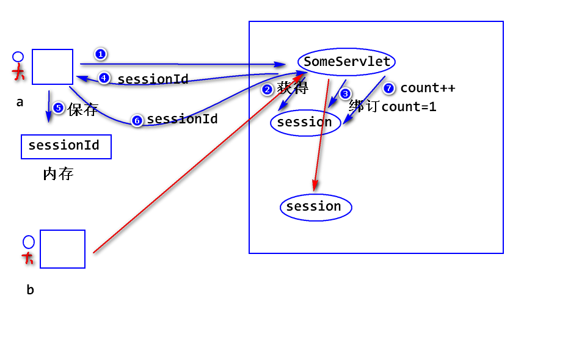
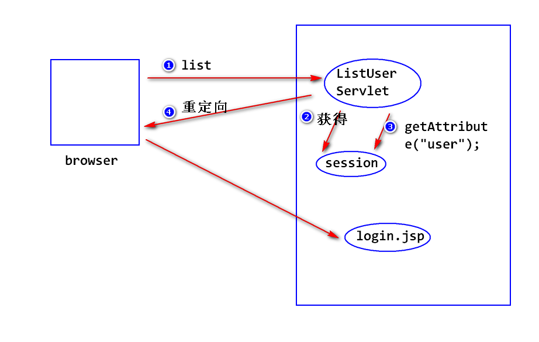

2018-6-5  Day07

## Cookie的限制
		a.可以被用户禁止

		b.不安全.
		    注:对于敏感信息,不建议保存在Cookie里,如果一定要保存,则一定要加密.

		c.Cookie只能保存少量数据,大约4KB左右.

		d.Cookie的数量也有限制.
		    注:浏览器端大约只能保存几百个左右的Cookie

		e.只能保存字符串.

# Session (会话)

## 什么是Session?
- 服务器端为了保存用户状态而创建的一个特殊的对象.
- 工作原理 :
		a. 当浏览器访问服务器时,服务器创建session对象(该对象有一个唯一的ID,一般称之为SessionId),服务器会将SessionId以Cookie的形式发送给浏览器;
		b. 当浏览器再次访问服务器时,会将SessionId发送过来,服务器利用SessionId找到对应的Session对象.

- 如何获得Session对象?
		方式一:
			HttpSession s = request.getSession(boolean flag);
			注:
			  a.HttpSession是一个接口.
			  b.当flag为true时:
			  	先查看请求当中是否有sessionId,如果没有,则创建一个session对象,如果有sessionId,则依据该sessionId去查找对应的session对象.如果找到了,则返回该对象,如果找不到,则创建一个新的session对象.
			  c.当flag为false时:
			    先查看请求当中是否有sessionId,如果没有返回null,如果有sessionId,则依据该sessionId去查找对应的session对象,如果找到了,则返回该对象,如果找不到,返回null,

		方式二:
		   HttpSession s = request.getSession();
		   等价于 request.getSession(true);

- 如何使用session对象? :　绑定数据相关的方法．
		setAttribute(String name,Object obj);
		Object getAttribute(String name);
		注: 如果找不到对应的值,返回null;
		removeAttribute(String name);
## (5)统计访问次数

- session超时:
	- 什么是session超时?
	  服务器会将空闲时间过长的session对象删除掉.
	      注:
	        a.这样做的目的是为了节省内存空间.
		    b.缺省的超时时间长度为30分钟.

	- 修改超时时间:
	        一般没必要修改,如果要修改,一个是改配置文件: servers -> web.xml -> session-config标签里边的数值.(影响所有的)
	        另一种方式通过 setMaxInactiveInterval(int seconds)  (影响当前的,单位是秒):两次请求之间的间隔不能超过指定的时间长度,如果超过,session对象会被删除.

- 删除session:
		invalidate();

- session验证()
	- step1 : 登录成功之后,在session对象上绑定一些数据,比如:
			session.setAttribute("user",user);
	- step2 : 当用户请求某个地址时，进行session验证:
			Object obj = session.getAttribute("user");
			if(obj == null){
				//没有登录，重定向到登录页面
				response.sendRedirect("login.jsp");
			}

## 容器如何处理请求资源路径
	比如,在浏览器地址输入 http://ip:port/Servletday07/abc.html
	step1. 容器默认认为访问的是一个servlet,去查看web.xml,看是否有匹配的servlet.
		注: 有三种匹配方式:
		 a. 精确匹配  使用<url-pattern>/abc.html</url-pattern>的内容匹配.
		 b. 通配符匹配 使用 `*` 来匹配零个或者多个任意的字符.
		    比如 <url-pattern> /*<url-pattern>
			     <url-pattern>/demo/*</url-pattern>
		 c. 后缀匹配
		 	使用 `*.` 开头,后接一个任意的后缀.
 			比如 <url-pattern>*.do</url-pattern>
			以上配置会匹配所有以.do结尾的请求

	step2. 如果没有匹配的servlet,再去查找对应位置的文件.

## 如何让一个Servlet处理多种请求?
	step1. 该servlet采用后缀匹配。
	<servlet-mapping>
  		<servlet-name>actionServlet</servlet-name>
  		<url-pattern>*.do</url-pattern>
  	</servlet-mapping>

	step2.分析请求路径，依据分析结果，进行不同的处理。
		//获得请求资源路径
		String uri = request.getRequestURI();
		System.out.println("uri: " + uri);

		/*为了方便比较，截取请求资源路径的一部分,
		我们把这一部分称之为请求路径*/
		String path=uri.substring(uri.lastIndexOf("/") ,uri.lastIndexOf("."));
		System.out.println("path: " + path);

		//依据请求路径，进行对应的处理
		if("/list".equals(path)){
			System.out.println("用户列表...");
		}else if("/add".equals(path)){
			System.out.println("添加用户...");
		}

