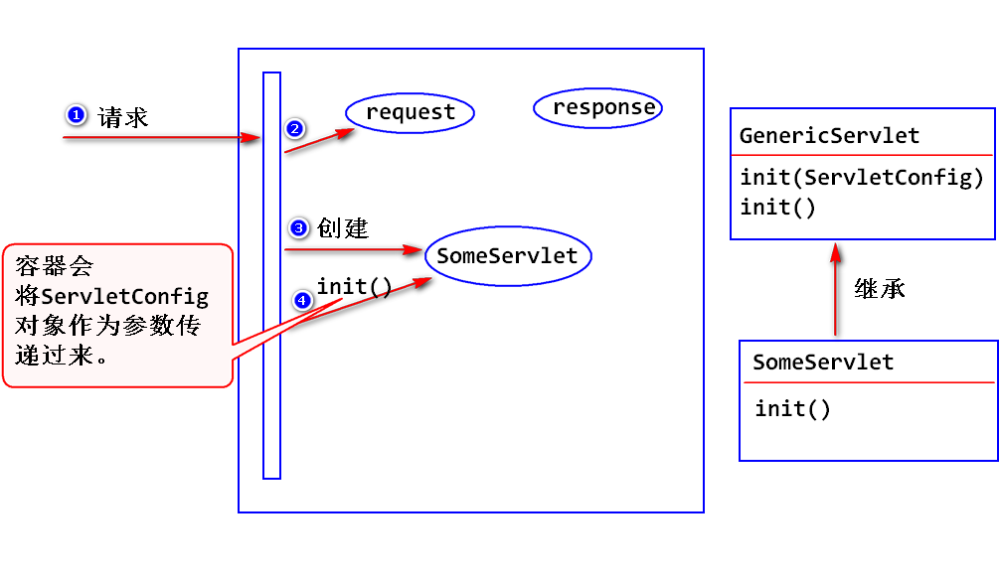
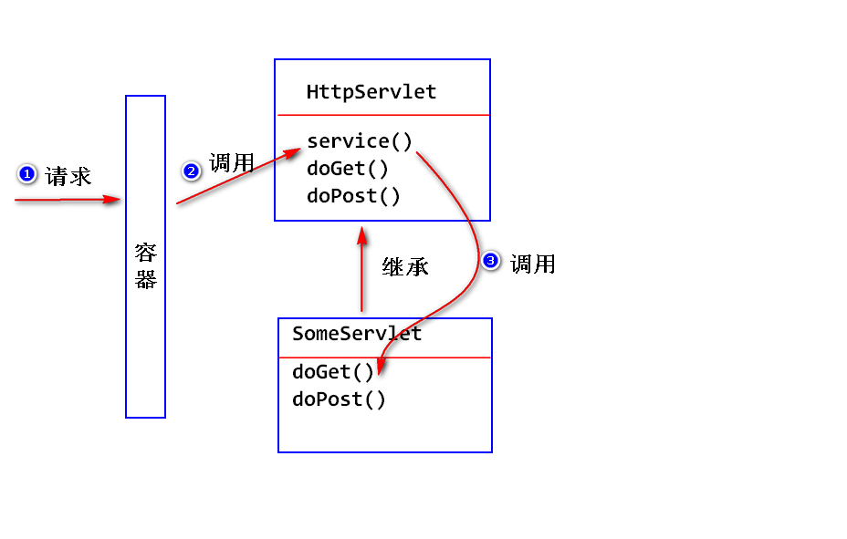
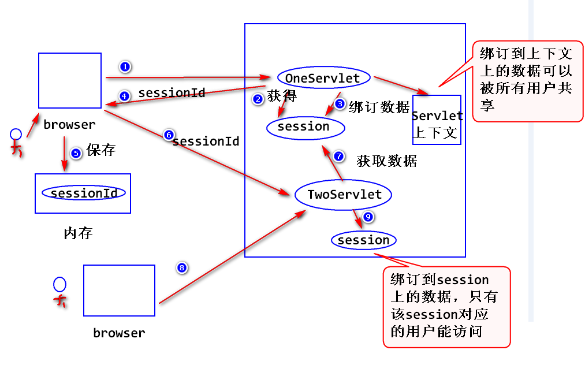

2018-6-6  Day08

# Servlet的生命周期

## 什么是Servlet的生命周期?
- Servlet如何去创建Servlet对象,如何对其进行初始化处理,如何调用其方法处理请求,以及如何销毁该对象的整个过程.

## 生命周期分成哪几个阶段？
- 第一个阶段 : 实例化
		a.什么是实例化?
		     容器调用servlet的构造器,创建servlet对象.

		b.什么时候实例化?
			 情形1 : 容器收到请求之后才会实例化.
			 情形2 : 容器启动之后,立即创建.
			    注 : 情形2需要额外的配置.
				<!--
  	        		 配置启动加载:即容器启动之后,会立即创建响应的实例.
					 注:
					    值是一个大于等于零的整数,值越小,优先级越高(优先被创建).
				 -->
				<load-on-startup>1</load-on-startup>

		c.会创建几个实例?
		     容器只会创建一个实例!

- 第二个阶段 : 初始化
		a.什么是初始化?
		  容器调用Servlet的init方法.
		  注: 该方法只会执行一次!!

		b.GenericServlet已经提供了init方法的实现.
		  注: 它会将容器传递过来的ServletConfig对象保存下来了,并且提供了一个方法(getServletConfig)来获得该对象.[间接继承过来的]

		c.如何实现自己的初始化处理逻辑?
		  我们只需要Override GenericServlet的init方法.
		  注:
		     overide 不带参的那个init方法.

		d.初始化参数
			step1 :
			<!-- 配置初始化参数 -->
			<init-param>
				<param-name>company</param-name>
				<param-value>IBM</param-value>
			</init-param>

		   step2 : 使用ServletConfig提供的getInitParameter

- 第三个阶段 : 就绪(调用)
		a. 什么是就绪?
		   容器收到请求之后,调用Servlet的service方法来处理请求.

		b. HttpServlet已经提供了service方法的实现,为什么还要重写service方法呢?
		   注:
		      依据请求类型,调用对应的doxxxx方法.
		      比如说get请求调用doGet方法,post请求调用doPost方法(这两个方法只是抛出了一个异常,因为编写这个API的人不知道开发者会有什么需求)
		c.写servlet,可以有两个选择:
		1. override HttpServlet的service方法.
		2. override HttpServlet的doGet方法/doPost方法.

- 第四个阶段 : 销毁
	- 什么是销毁?
	      容器在删除servlet对象之前,会调用destroy方法.
	      注:
	         该方法只会执行一次!

	- GenericServlet以及提供了destroy方法的实现,即使我们不写没有问题.
		  注:
		     该方法是一个空方法,什么都没做,需要自己做.

	- 如何实现自己的销毁处理逻辑?
		  注:
		    override GenericServlet的destroy方法.(重写它)

> 小总结:
> init方法：是在servlet实例创建时调用的方法，用于创建或打开任何与servlet相的资源和初始化servlet的状态，Servlet规范保证调用init方法前不会处理任何请求

>service方法：是servlet真正处理客户端传过来的请求的方法，由web容器调用，根据HTTP请求方法（GET、POST等），将请求分发到doGet、doPost等方法

>destory方法：是在servlet实例被销毁时由web容器调用。Servlet规范确保在destroy方法调用之前所有请求的处理均完成，需要覆盖destroy方法的情况：释放任何在init方法中打开的与servlet相关的资源存储servlet的状态

## 相关的接口与类?
- Servlet接口
	- init()
	- service()
	- destroy()

- GenericServlet抽象类
  注: 实现了Servlet接口中的部分方法(init和destroy).

- HttpServlet抽象类
  注: 继承了GenericServlet,实现了service方法.

## Servlet上下文
- 什么是servlet上下文?
  容器启动之后,会为每一个web应用创建唯一的一个符合ServletContext接口要求的对象,该对象一般我们称之为servlet上下文.
  	注:
		唯一性 : 一个web应用对应一个上下文.
		持久性 : 只要容器不关闭,应用没有被写在,那么上下文就会一直存在.

- 如何获得Servlet上下文?
  GenericServlet提供了getServletContext()方法来获得上下文.

