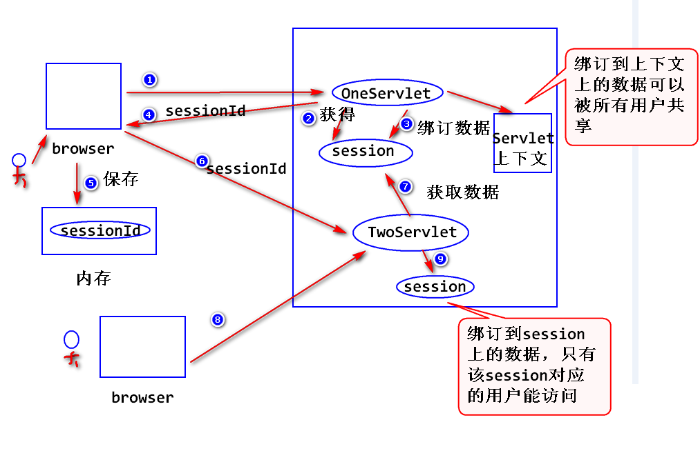
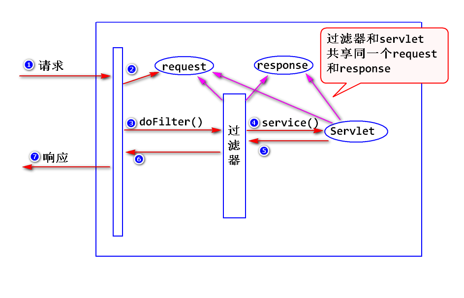
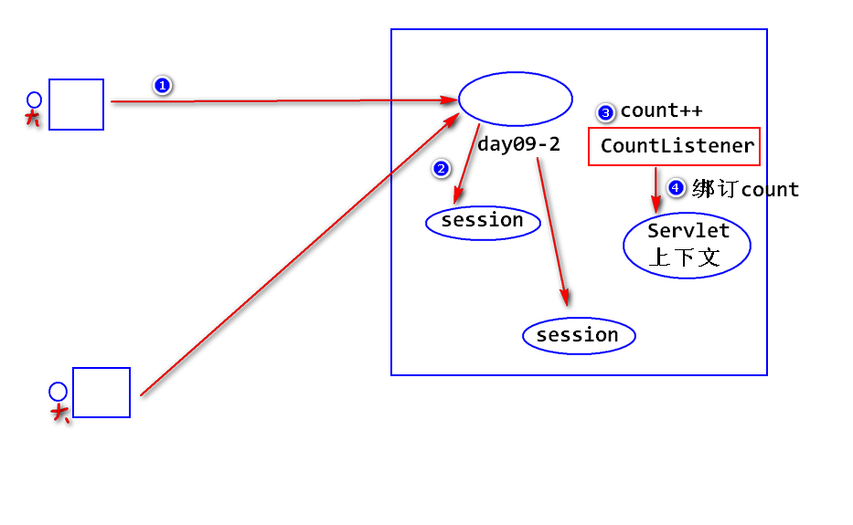

2018-6-7  Day09
##作用?
  1. 绑定数据
 		setAttribute  : 绑定值
 		getAttrubute  : 获取值
 		removeAttribute : 删除
 		注:
 		request,session,servlet上下文都提供了绑定数据相关的方法,如何选择?
     		-> 这三个对象,生存时间长度依次为 request< session < servlet上下文.在满足使用条件的情况下,尽量有限使用生命周期短的.

> 绑定到session对象上面的数据只能被sessionID对应的对象才能访问,而绑定到上下文的数据可以被所有用户共享.

## 读取全局的初始化参数
- 什么是全局的初始化参数?
  -> 可以被同一个应用中的所有组件共享的初始化参数.

- 如何使用?
  -> step1:配置
	  <!-- 配置全局变量 -->
	  <context-param>
		<param-name>company</param-name>
		<param-value>IBM</param-value>
	  </context-param>

  -> step2:读取
		ServletContext.getInitParameter(String paramName);

## 过滤器
- 什么是过滤器?
	Servlet规范当中定义的一种特殊的组件,用来拦截servlet容器的调用过程.
	  注:
	      容器收到请求之后,会先调用过滤器,再调用后续的其他组件.

- 如何写一个过滤器
	step1 : 写一个java类,实现Filter接口.
	step2 : 在接口方法当中实现拦截处理逻辑.
	step3 : 配置过滤器(在部署描述文件web.xml配置).
	  <!-- 配置过滤器 -->
	  <filter>
		<filter-name>CommentFilter</filter-name>
		<filter-class>web.CommentFilter</filter-class>
	  </filter>
	  <filter-mapping>
		<filter-name>CommentFilter</filter-name>
		<url-pattern>/comment</url-pattern>
	  </filter-mapping>

- 过滤器的优先级:
	当有多个过滤器都符合拦截的要求,则依据配置的先后顺序来执行.

- 初始化参数:
	step1 : 配置初始化参数
		<init-param>
			<param-name>初始化参数名</param-name>
			<param-value>初始化参数值</param-value>
		</init-param>

	step2 : 调用FilterConfig的getInitParameter方法读取初始化参数.

- 过滤器的优缺点:过滤器是在java web中，你传入的request,response提前过滤掉一些信息，或者提前设置一些参数，然后再传入servlet或者struts的 action进行业务逻辑，比如过滤掉非法url。主要为了减轻服务器负载。减少压力

## 监听器
- 什么是监听器?
  Servlet规范当中定义的一种特殊的组件,用于监听servlet容器产生的时间并进行相应的处理.
      注:
        容器会产生两大类时间:
		a.生命周期相关的时间.
		  容器创建或者销毁了request,session,servlet上下文时产生的事件.

		  例如需要统计在线人数,可统计session对象的个数可以知道有多少个用户.

		b.绑定数据相关的时间.
		  调用了request,session,servlet上下文的setAttribute和removeAttribute方法时产生的事件.

- 如何写一个监听器?
	step1 : 写一个java类,依据监听的事件类型,选择实现对应的监听器接口.
	    比如:要监听session创建和销毁对应的时间,需要实现HttpSessionListener接口.

	step2 : 在接口方法当中,实现监听处理逻辑.

	step3 : 配置监听器. (在部署描述文件web.xml配置)
	  <!-- 配置监听器 -->
	  <listener>
		<listener-class>web.CountListener</listener-class>
	  </listener>

## (3)在线人数统计

