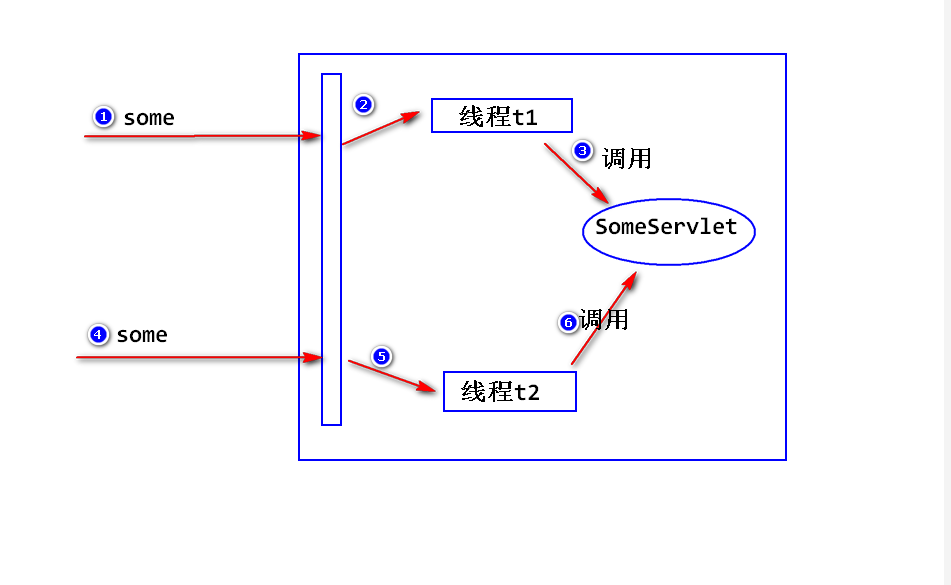
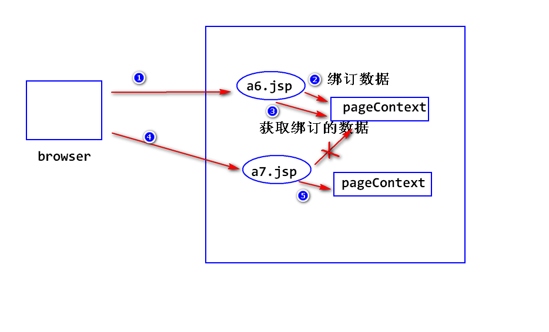

2018-6-8  Day10

## 过滤器的优点
- 在不修改原有代码的基础上,为系统增加一些新的简单的功能.
- 将多个模块相同的功能集中写在一个类里面,方便代码的维护.

#### 监听器两大类事件:
- 生命周期相关 : request,session,servlet上下文
- 绑定数据相关 : setAttribute,removeAttribute.

## Servlet线程安全问题
- 为什么说Servlet会有线程安全问题?   (经典面试题)
	a. 容器只会创建一个Servlet实例.
	b. 容器收到一个请求,就会启动一个线程,由这个线程调用Servlet实例来处理请求.这样一来的话,就有可能有多个线程同时去调用某个Servlet实例,就有可能发生线程安全问题(比如说,当多个线程要修改某个属性值时).

- 如何解决?
	使用synchronized对有可能产生线程安全问题的代码块加锁.
	注: 加锁之后,会影响性能.

# Servlet总结
#### Servlet基础
- 什么是servlet?
- 如何写一个Servlet?
- servlet是如何运行的?
- Http协议?
	a.什么是http协议
	b.特点
	c.数据包的结构
	d.消息头,状态码

#### Servlet核心
- 如何读取请求参数值?
- 表单包含有中文参数值,如何处理?
- Servlet输出中文,要注意什么?
- 容器如何处理请求资源路径?
- 如何让一个Servlet处理多种请求?

- 转发与重定向
	a.什么是重定向?
	b.如何重定向?
	c.重定向的特点?
	d.什么是转发?
	e.如何转发?
	f.转发的特点?
	g.转发与重定向的区别?

- Servlet生命周期
	a.什么是servlet生命周期?
	b.分成哪几个阶段?
	c.相关的接口与类?

- 路径问题?
- 线程安全问题?
- Servlet上下文
	a.什么是上下文?(ServletContext接口)
	b.特点:唯一性,持久性
	c.如何获得上下文? FilterConfig(过滤器获得上下文),ServletConfig(容器获得上下文)
	d.作用:用来绑定数据,使数据传递.
	e.requeset,session,上下文均可以绑定数据,有何区别?

#### 状态管理
- 什么是状态管理?
	将浏览器与web的多次交互的数据保存下来.

- Cookie
	a.什么是Cookie? 服务器临时存放在客户端的少量数据(数据一般存放在内存中)
	b.工作原理?
	c.如何添加一个cookie?
	d.三个问题(编码问题,生存时间问题,路径问题)
	e.如何读取cookie?
	d.cookie有什么限制?(可以被用户限制,数量有限制,大小有限制,只能保存字符串)

- Session
	a.什么是Session? 服务器为了保存用户状态生成的对象
	b.工作原理?
	c.如何获得session对象?
	d.绑定数据相关的几个方法?
	e.session超时
	f.删除session

- Session与Cookie的比较
		session优点 : 安全(因为数据都保存在服务器端,需要对应的sessionId才能访问),还有就是可以保存更多的数据类型.Cookie不安全,只能保存少量的数据,只能保存字符串,最多不能超过大约4K的数据.

		session缺点 : 因为所有数据都保存在服务器端,如果用户量大,会占用大量的内存,服务器压力大.而Cookie是将数据保存在浏览器端,不会占用服务器资源.

- 如何使用 :
		考虑用户量大,数据安全性的考虑用seesion,如果没有这方面的需求,用cookie会比较好.一般情况下,session和cookie都会使用.

#### 数据访问
- 利用DAO访问数据库
- 处理异常,将异常抛出来.(服务器异常,用来告诉用户: 系统繁忙稍后重试...)

#### 过滤器与监听器
	a.什么是过滤器?
	b.若何写一个过滤器?
	c.优先级?
	d.初始化参数?
	e.优点?
	f.什么是监听器
	g.如何写一个监听器

#### 案例
- session验证写在servlet里面
- session验证写在过滤器里面
- 用户管理系统:
        (第一版:全部使用Servlet)
        将业务处理逻辑拿了出来

## JSP基础
- 什么是JSP
	  SUN公司制定的一种服务器端动态页面技术规范.
	  注:
		a.jsp是一个以 .jsp 为后缀的文件,内容主要是html和少量的java代码
		b.容器会将该文件转换成一个对应的Servlet然后执行,所以说JSP本质就是一个Servlet.

- 如何写一个JSP文件
	step1 : 添加一个以 .jsp 为后缀的文件.
	step2 : 在该文件当中,可以使用以下元素
	   1.HTML(包含css,js) : 直接写即可
	   2.java代码 :
	     第一种写法 : java代码片段<% %>
		 第二种写法 : jsp表达式 <%= java表达式 %>
		 第三种写法 : jsp声明 <%! 声明一个方法或者变量 %>
	   3.指令
	   	 a. 什么是指令?
		    通知容器,在将jsp转换成servlet时,做一些额外的处理,比如导包.
		 b. 语法:
		 	<%@ 指令名 属性=值%>
		 c. page指令
		      import属性: 指定要导入的包.
			  pageEncoding属性: 告诉容器,jsp文件的编码.
			  contentType属性: 设置setContentType方法的参数.
			  session属性: (a2.jsp)
			  缺省值是true,如何设置为false,则不能够使用session隐含对象
			  errorpage属性:(a3.jsp)
			  				用来指定一个异常处理页面,当JSP运行出错,容器会调用异常处理页面.
			  isErrorPage属性:(a4.jsp)
			  			    缺省值是false,如果值为true,则可以使用exception隐含对象.
		 d.include指令
		 	  file属性: 指定被包含的文件.

		 e.taglib指令
		 	  用于导入jsp标签.

- 隐含对象
		a.什么是隐含对象?
		b.为什么可以直接使用这些隐含对象?
		c.有哪些隐含对象?
		out,request,response,session,application
		exception: 只有在isErrorPage="true" 时才能使用.
		pageContext:(A6.jsp,A7.jsp)
			c1.pageContext是什么?
			容器会为每一个jsp实例都会创建一个唯一的一个符合PageContext接口要求的对象.
			c2.特点:
			       持久性: 只要JSP实例还在,则pageContext会一直存在
				   唯一性: 一个JSP实例对应一个pageContext

			c3.作用
				   作用1: 绑定数据
				   注: 绑定到pageContext上的数据,只有对应的jsp实例能访问到.
				   作用2 : 提供了获得其他所有隐含对象的方法.
		config: 本身就是servletConfig
		page: jsp实例本身.
			  jsp对应的那个servlet实例.

- JSP是如何运行的?
	- 阶段一: 容器将jsp转换成一个Servlet
	  html ----> service方法里,使用Out.write输出.
	  <%%> ----> service方法里,原样照搬
	  <%= %> ----> service方法里,使用out.print输出.

	- 阶段二: 容器调用该Servlet

- 注释 (a8.jsp)
	a. <!-- 注释内容 -->
  	注: 
	     如果注释的内容是java代码,则java代码会执行.但是页面不可见

	b. <%-- 注释内容 --%>
	注：
		 Java代码不会被执行。

## JSP标签和el表达式
- jsp标签是什么?
  sun公司制定的一种用来替换jsp中java代码的技术,语法类似于html标签.容器遇到jsp标签之后,会找到标签对应的标签类然后执行.
      注:
         a.因为直接在jsp文件中写Java代码,不利于Jsp文件的维护.比如:将包含有Java代码的jsp交给美工区修改就很不方便.所以sun才制定了jsp标签技术规范.
		 b.使用Jsp标签,jsp标签会变得更简洁,方便维护,同时方便代码的复用.

- el表达式是什么?
  它是一套简单的运算规则,用于给jsp标签的属性赋值.也可以脱离标签直接使用.

- el表达式的使用:
  - 访问bean的属性
  	  注:
	     如果一个java类满足如下几个条件,就可以称之为javabean:
		 a.它是公开的(public class)
		 b.public 构造器
		 c.实现序列化接口(implements Serializable)
		 含有get/set方法.

- 方式一: (e1.jsp)
		${user.username}
		注:
		   a.执行过程:
		   容器依次从pageContext -> request -> session -> application这四个对象中查找绑定名称为"user"的对象(即调用getAttribute方法),找到该对象之后,调用getUsername方法,然后输出计算结果.
		   b.它会将Null转换成空""输出.
		   c.如果已经绑定名找不到对应的值,不会报空指针异常,仍然输出空字符串.
		   d.可以使用pageScope,requestScope,sessionScope,applicationScope来指定查找范围.
		   例如: 从session对象中查找:
		   ${sessionScope.user.username}

- 方式二(e1.jsp)
		${user['username']}
		注:
			a.执行过程同方式一
			b.允许[]里面使用绑定名.
			c.允许[]里面使用从0开始的下标,用于访问数组中的某个元素. 