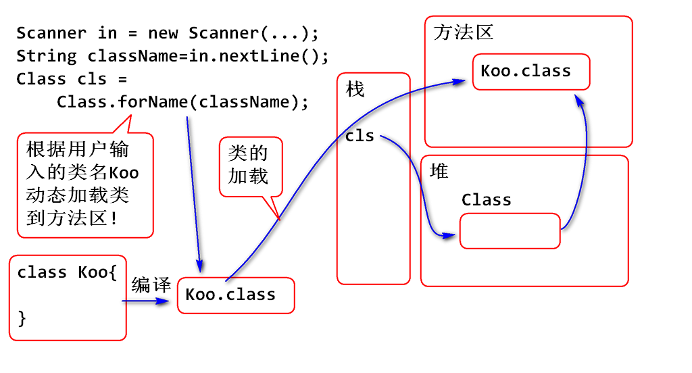
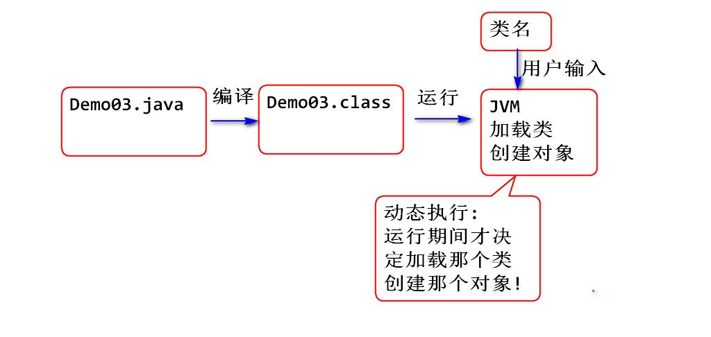

2018-6-12  Day12

## MVC是什么？
- `Model View Controller`: 即模型视图控制器
- 它是一种软件架构思想，其核心思想是要将数据库处理与数据展现分开，按照这种思想，我们一般将软件化划分成三种不同类型的模块，分别是 :
	- 模型（用来处理业务逻辑、即数据处理）
	- 视图（数据展现、即用户交互的界面）
	- 控制器（用来协调模型和视图的）
	      注：
	       用户通过视图将请求发送给控制器，由控制器选择合适的模型来处理;
		   模型返回的处理结果也要先交给控制器，由控制器选择合适的视图来展现处理结果;
> 控制器根据请求调模型、根据结果调视图

## 如何使用MVC？
- 在web开发当中，我们可以使用Java类充当模型，使用Servlet充当控制器，使用JSP充当视图。
- 可参照 ServletDay12_MVC

## MVC的优点
- 方便代码的维护: 模型或者视图发生了改变，不会彼此影响。
	- 比如计算Bmi指数，可以使用不同的视图来展现处理结果,那么添加新的试图时，并不影响模型;反过来如果有了新的模型来计算Bmi指数，也不会影响视图。

- 方便测试: 将业务逻辑写在java类里面，可以直接测试。如果将业务逻辑写在servlet里面，需要部署整个应用才能测试。

- 方便分工协作:

## MVC的缺点
- 使用MVC会增加代码量、相应的会增加软件开发的成本、同时也会增加软件设计的难度。所以，对于相对比较简单的应用，不需要使用MVC。

## 实现一个MVC框架
#### java反射基础
- Java 提供了一套API
- 提供了检查一个对象内部结构的手段
- 反射API可以
		1. 动态加载类
		2. 动态创建对象
		3. 动态访问属性
		4. 动态调用方法
> 反射API提供了"动态"执行功能!

		Foo foo = new Foo();
	    foo.print();

## 反射检查对象的类型结构
引子:

	调用方法
	test("ABC");
	test('A');
	test(1);

	public void test(Object obj){
		// obj 是什么具体类型的?
		// 此类型中有哪些属性?
		// 此类型有哪些方法?
	}

反射API可以动态检查对象的类型, 类型的内部结构

检查对象类型的方法:

	Class cls = obj.getClass();
	//返回值 cls 代表对象的类型.
	
	public void test(Object obj){
		// obj 是什么具体类型的?
		Class cls = obj.getClass();
		System.out.println(cls);
	}

反射API可以检查类型的内部结构:

	//检查对象的类型中声明了哪些属性
	// Declared: 声明的(定义的)
	// Field : 字段,属性
	/*
	 * 动态获取cls代表的类型中声明的属性
	 * Field 类型来自反射包 java.lang.reflect
	 * 代表一个类中声明的属性信息
	 */
	Field[] fields =
			cls.getDeclaredFields();
	for (Field field : fields) {
		System.out.println(field); 
	}
	// Method: 方法
	// Method 来自reflect包, 代表cls中声明
	// 方法信息.
	Method[] methods = 
			cls.getDeclaredMethods();
	for (Method method : methods) {
		System.out.println(method); 
	}
	
	//获取类中声明的全部构造器信息
	//Constructor 构造器/构造方法
	Constructor[] constructors=
		cls.getDeclaredConstructors();
	for(Constructor c:constructors){
		System.out.println(c); 
	}

## 动态加载类

API方法

	Class cls = Class.forName(类名);

原理为:

案例:

	/*
	 * 动态加载类到内存中
	 */
	Scanner in = new Scanner(System.in);
	System.out.print("输入类名:");
	String className=in.nextLine();
	//动态加载类
	//当类名错误时候,会抛出类没有找到的异常
	Class cls=Class.forName(className);
	System.out.println(cls); 
	//可以继续检查cls的内部结构...

案例: 类只加载一次

	public static void main(String[] args)
		throws Exception {
		/**
		 * 类只加载一次, 即便多次调用forName
		 * 方法, 类也加载一次, forName返回值
		 * 是同一个对象的引用
		 */
		Scanner in = new Scanner(System.in);
		System.out.print("输入类名:");
		String className=in.nextLine();
		//动态加载类
		Class cls1 = Class.forName(className);
		Class cls2 = Class.forName(className);
		Class cls3 = Class.forName(className);
		System.out.println(cls1==cls2); 
	}

## 动态创建对象

API 方法

	//Instance 实例(对象)
	// 创建cls代表的类型的实例
	// cls 类型上必须包含无参数构造器(可以是默认构造器)
	// newInstance就是调用这个无参数构造器创建对象!
	// 如果没有无参数构造器则抛出异常!
	Object obj=cls.newInstance();

> 可以利用Constructor调用有参数构造器创建对象, 因为使用少, 这里省略了. 

案例:

	public static void main(String[] args)
			throws Exception{
		/*
		 * 动态加载类到内存中
		 */
		Scanner in = new Scanner(System.in);
		System.out.print("输入类名:");
		String className=in.nextLine();
		//动态加载类
		//当类名错误时候,会抛出类没有找到的异常
		Class cls=Class.forName(className);
		System.out.println(cls); 
		//可以继续检查cls的内部结构...
		
		//利用反射API动态创建对象
		Object obj = cls.newInstance();
		System.out.println(obj); 
	}

## 动态访问属性

API 方法	

在 Field 类型上定义了get方法, 可以用于获取对象的属性值
如果需要动态获取属性的值:

- 利用Class类型对象的方法,才能获取Field类型对象
	- obj.getClass();
	- Class.forName();
- 获取Field类型对象
- 获得对象
	- new 一个对象
	- newInstance 创建对象
- 调用get方法

		Object val = fld.get(obj)
		//在对象obj上读取属性
案例:
	public static void main(String[] args)
		throws Exception{
		/*
		 * 动态访问对象的属性
		 */
		Scanner in = new Scanner(System.in);
		System.out.print("输入类名:");// Koo
		String className=in.nextLine();
		System.out.print("输入属性名:");// name
		String fieldName=in.nextLine();
		//加载类
		Class cls=Class.forName(className);
		//查找类中的属性(API 方法)
		// getDeclaredFields 获取全部属性
		// getDeclaredField(name) 获取指定名字的
		//                       一个属性
		Field fld=cls.getDeclaredField(fieldName);
		System.out.println(fld);
		//动态创建对象, obj 一定包含指定属性值
		// Koo koo = new Koo();
		Object obj = cls.newInstance();
		//在obj对象上获取fld属性的值, 如果obj上
		// 没有fld属性的值, 则抛出异常

		//Access 访问 Accessible 可以访问的
		fld.setAccessible(true);

		Object val = fld.get(obj);
		//属性名是用户运行期间输入的! 输入那个属性
		//名这段程序就会输出那个属性的值!
		//也就意味着, 程序与属性之间是松耦合的关系
		System.out.println(val);
	}

## 利用反射API可以访问不可见成员

无论私有属性还是私有方法, 都可以利用反射API进行调用, 在调用之前使用 fld.setAccessible(true);

fld.setAccessible(true) 执行以后可以打开原有私有的访问权限.
不仅仅如此, fld.setAccessible(true) 还可以打开任何不可见属性/方法的访问权限.

案例:

	public static void main(String[] args)
		throws Exception{
		/*
		 *　访问私有属性
		 */
		Scanner in = new Scanner(System.in);
		System.out.print("输入类名:");// Koo
		String className=in.nextLine();
		System.out.print("输入属性名:");// name
		String fieldName=in.nextLine();
		//加载类
		Class cls=Class.forName(className);
		//查找类中的属性(API 方法)
		// getDeclaredFields 获取全部属性
		// getDeclaredField(name) 获取指定名字的
		//                       一个属性
		Field fld=cls.getDeclaredField(fieldName);
		System.out.println(fld);
		//动态创建对象, obj 一定包含指定属性值
		// Koo koo = new Koo();
		Object obj = cls.newInstance();
		//在obj对象上获取fld属性的值, 如果obj上
		// 没有fld属性的值, 则抛出异常
		
		//Access 访问 Accessible 可以访问的
		fld.setAccessible(true);
		
		Object val = fld.get(obj);
		//属性名是用户运行期间输入的! 输入那个属性
		//名这段程序就会输出那个属性的值! 
		//也就意味着, 程序与属性之间是松耦合的关系
		System.out.println(val);
	}

## 反射的用途

解耦!

利用反射可以实现一段程序与未来一个类之间耦合在一起, 这段程序就与未来的类之间是松耦合的关系-- 也就是解耦了! 

如: Eclipse 可以开发任何未来的程序, 解析任何未来程序的结构.

经典面试题目: 

	Eclipse 的快捷菜单用到了哪些技术?
	答: Eclipse利用反射技术实现快捷菜单, 可以使Eclipse与被开发的类解耦.

## 利用反射访问对象的方法

访问方法的核心API

	// invoke 调用 
	// obj是包含当前method方法的对象
	method.invoke(obj, 参数1, 参数2 ...)

使用步骤:

- 获得Class对象
	- Class.forName(类名)
- 利用Class对象的方法找到 Method 对象
	- Method getDeclaredMethod(方法名) 根据方法名找到Method对象
- 获得方法对象 method
- 得到包含方法的对象obj
	- cls.newInstance()
- 准备参数(选项)

		Object val = method.invoke(obj)

案例:

	public static void main(String[] args) 
		throws Exception{
		/*
		 * 利用反射API动态执行对象的方法 
		 */
		Scanner in = new Scanner(System.in);
		System.out.print("输入类型:");
		String className=in.nextLine();
		System.out.print("输入方法名:");
		String methodName=in.nextLine();
		//动态加载类
		Class cls=Class.forName(className);
		//在类cls中找到需要执行的methodName方法
		//如果方法名错误,将抛出没有找到方法异常
		Method method=
		  cls.getDeclaredMethod(methodName);
		System.out.println(method);
		//执行invoke时候, obj对象一定是包含
		//指定method的对象! 否则将出现异常
		Object obj = cls.newInstance();
		//动态调用方法
		method.setAccessible(true); 
		Object value = method.invoke(obj);
		//输出方法的返回值
		System.out.println(value);
	}

## getDeclaredMethod 与 getMethod

cls.getDeclaredMethod 在当前cls类型上查找当前类中声明的全部方法
	- getDeclaredMethod 只查询当前类
cls.getMethod 在当前cls类型以及全部继承的方法中查找声明的方法
	- 查询当前类和父类中继承的方法

## 反射总结

1. Java的"动态"执行 API
	- 动态加载类
	- 动态创建对象
	- 动态访问属性
	- 动态执行方法
2. 可以用于实现软件组件的"解耦"
	- 可以实现现在组件和未来的组件耦合关系, 调用未来的程序组件

例子: 
	Eclipse 的快捷菜单使用反射技术
	WebServer与未来的Servlet组件的耦合也是使用反射技术

#### java注解
- 三类注解：
  	     1.RetentionPolicy.SOURCE:此类注解只保留在源文件，当Java文件编译成class文件的时候，注解被遗弃;
  	     2.RetentionPolicy.CLASS:此类注解被保留到class文件，当jvm加载class文件时被遗弃，这是默认的生命周期;
  		 3.RetentionPolicy.RUNTIME:此类注解不仅被保存到class文件中,jvm加载class文件之后，仍然存在;

